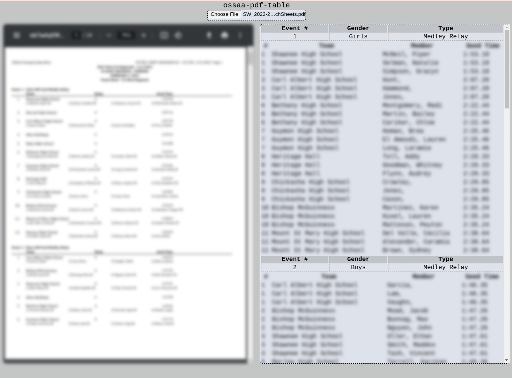

# ossaa-pdf-table

1. Given a HY-TEK Meet Manager event report PDF

2. Parses and formats it to an HTML table and/or CSV
3. which can be pasted into a spread sheet directly

## State
Not finished yet, a bit more parsing to do, then some testing

## Screenshot

## Implemented
- Ported lexer.ts, scanner.ts, and parser.ts from [@repcomm/JSON.java](https://gist.github.com/RepComm/72ad653df238ebe67b7734e2188a39d8) gist as a starting point
- Basic input/output side-by-side panels
- PDF upload button
- Swim meet specific parsing code
  - Event #, gender, type
  - Teams header
  - Team #, name, member names, seed time

## Dependencies
[@bundled-es-modules/pdfjs-dist](https://npmjs.com/@bundled-es-modules/pdfjs-dist) - npm ES module of Mozilla's pdfjs, for parsing text from PDFs

[@roguecircuitry/htmless](https://github.com/roguecircuitry/htmless) - my own HTML wrapper lib
